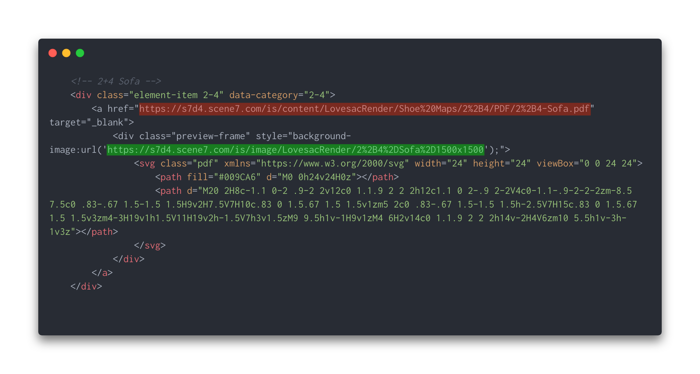

# Sactionals Configuration Guides

## Creating a Card

The Shoe Maps page is organized into cards corresponding to each possible config, which is then filtered down for presentation by Metafizzy's [Isotope](https://isotope.metafizzy.co/) plugin. The code above is a breakdown of what each one of these cards' content looks like programmatically, which can be easily copied from within the Hub page's editor. Each card should a commented-out title corresponding to the thumbnail/PDF's filename and arranged alphabetically under its seat/side count header for the sake of proper organization.

## Filtering in Isotope

Each card's outermost div contains a class and a `data-category` attribute, which correspond to the naming convention for each seat/side count (e.g. 7-8 refers to 7 Seats + 8 Sides). Every card should have the class "element-item" for styling purposes. If the config you're working on contains at least one Deep Side, include the class `d` and append `-d` to the data-category. Keep in mind that Deep Sides are counted in the total number of sides in your configuration. Configs with Wedge Seats will ultimately have their own class and data-category (`wedge`) when the time comes, which will also be added to the list of options in the dropdown select.

## Linking Thumbnails + PDFs

The url highlighted in red (in the first anchor) is the url of your config's PDF, while the url highlighted in green (in the style attribute for the second div) should be the url for its PNG image. Creative exports their PNGs and PDFs using the same filename prior to the extension, so make sure `-thumb` is placed at the end of the PNG's filename before the .png extension to ensure Scene7 accepts the upload.
